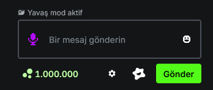
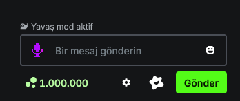

# kick-blerp-chat-fix
When you use the blerp extension in kick, the chat input section is broken, this css solves that problem.

<table>
  <tr>
    <th>Before</th>
    <th>After</th>
  </tr>
  <tr>
    <td></td>
    <td></td>
  </tr>
</table>
